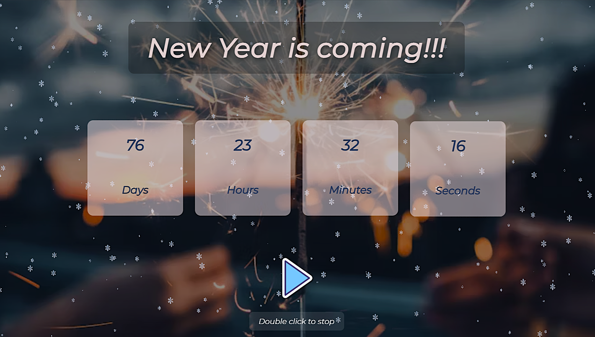

 New Year Countdown

 Description 
 
The New Year Countdown application is a fun and interactive web tool that displays a live countdown to January 1st.  
It helps users see the time remaining until the New Year in real time, adding excitement and anticipation as the date approaches.

About the Application

This application shows the countdown in days, hours, minutes, and seconds until the next January 1st.  
As time changes, the countdown updates automatically.  

The goal of this project was to create a dynamic UI that works with real-time data and updates continuously using JavaScript.
The countdown is visually styled to match the festive theme and provides a simple, intuitive user experience.

Live demo:  

https://newyearcountdownday.netlify.app/

Screenshot

Technologies Used

- JavaScript 
- HTML  
- CSS

 How to Run the Project

This is a frontend-only app — no installation required.  

1. Clone the repository:
 bash 
git clone https://github.com/ktrn-s/new-year-countdown.git

2. Open the project folder.

3. Open the index.html file in your browser.

That’s it! The countdown will start automatically.

 Challenges and Learnings
 
One challenge in this project was calculating the time difference between the current moment and the target date (January 1st).  

Handling time units correctly and updating the countdown every second helped strengthen my understanding of:
- JavaScript Date object
- Time calculations
- DOM manipulation
- Working with intervals (setInterval)

